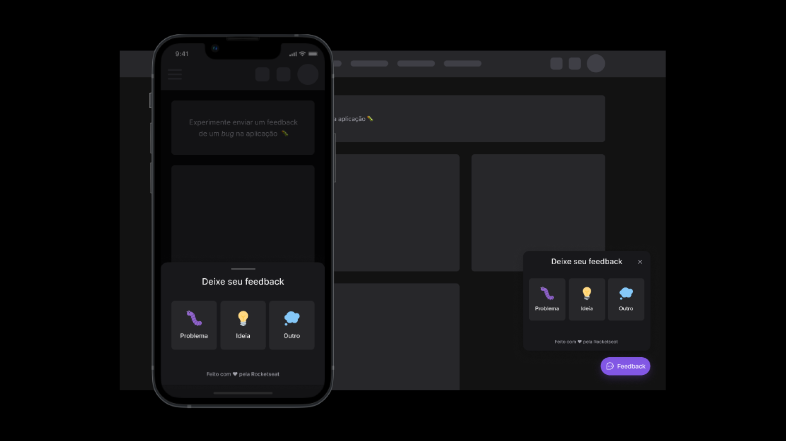

<h1 align="center">Feedget</h1>

  

  

  

## ✨ Tecnologias

Esse projeto foi desenvolvido com as seguintes tecnologias:

- [Node.js](https://nodejs.org/en/)
- [Typescript](https://www.typescriptlang.org/)
- [Express](https://expressjs.com/pt-br/)
- [Jest](https://jestjs.io/pt-BR/)
- [ReactJS](https://pt-br.reactjs.org/)
- [Expo](https://docs.expo.dev/)

## 💻 Projeto

Feedget é um Widget que fica na parte inferior da tela tanto web como mobile que serve para mandar Feedbacks, tanto positivos, negativos ou para o crescimento do sistema que está sendo usado.

## 🚀 Como executar

- Abaixo você encontrará o link para cada parte da aplicação como um todo. Está dividido em Server, Mobile e Web. 

## Repositórios

| Nome | Link |
| :-------- |:------------------------- |
| Web | https://github.com/lucas-rabelo/Feedget_web |
| Mobile | https://github.com/lucas-rabelo/Feedget_mobile |
| Server | https://github.com/lucas-rabelo/Feedget_server |

## 📄 Licença

Esse projeto está sob a licença MIT. Veja o arquivo [LICENSE](LICENSE.md) para mais detalhes.